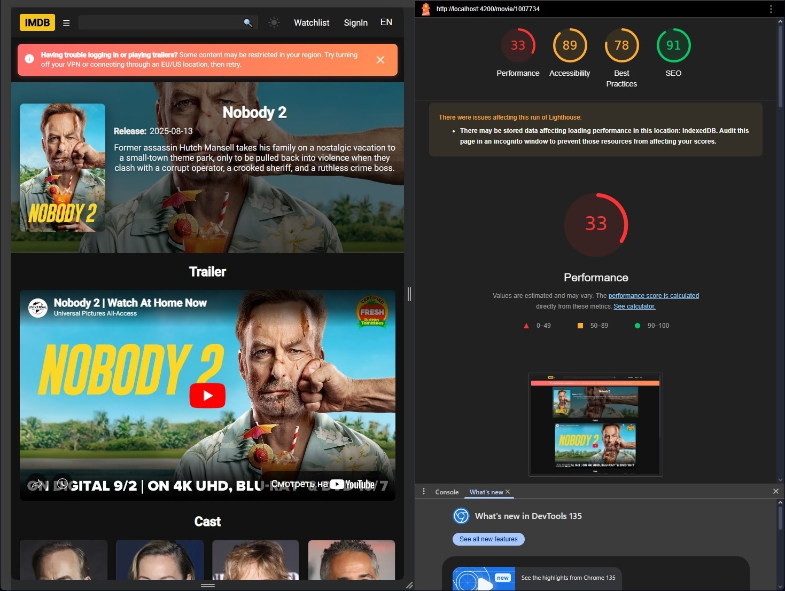
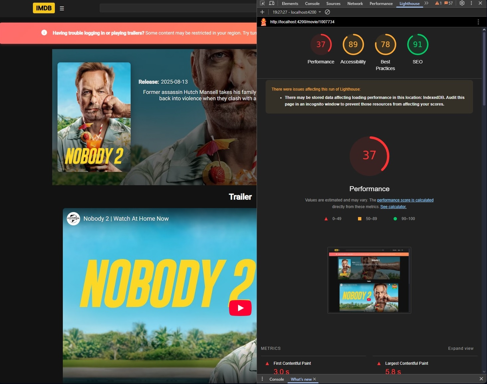

## 🚀 Performance Budget & Lighthouse Gains

This project includes a performance optimization pass focused on improving load times, responsiveness, and perceived UX for the `movie/:id` and `collection` pages.

### ✅ Key Improvements

- **Lazy image loading**: All `` elements now use native `loading="lazy"` to defer offscreen image loading. This reduces bandwidth usage and improves Largest Contentful Paint (LCP).
- **Virtual scrolling**: The cast list uses `cdk-virtual-scroll-viewport` to render only visible items, minimizing DOM size and improving Total Blocking Time (TBT).
- **Code splitting**: Heavy components are loaded on demand via Angular's `loadComponent`, reducing initial bundle size.
- **Data prefetching**: Movie data is preloaded via route resolver before component initialization, improving perceived responsiveness.

### 📉 Before Optimization

### 📈 After Optimization

> ⚠️ **Note:** API responses depend on VPN connectivity, which may introduce latency during audits. All measurements were taken under VPN conditions, which reflect real-world usage for this project.
